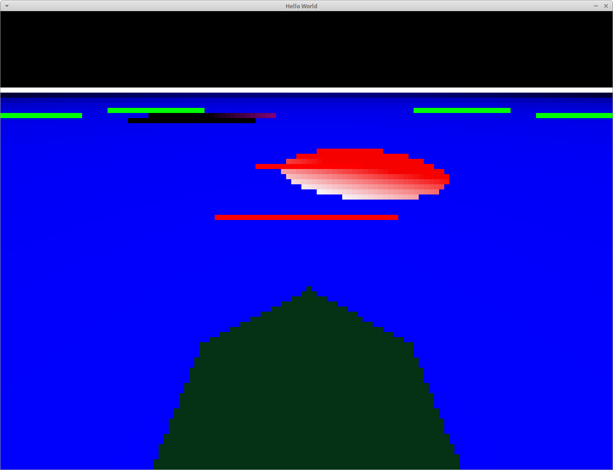

# drive_game



A small ray-tracing driving game. 

```
# Run the game (requires pygame, numpy, and cv2):
python3 main.py
```

* Use Wasd or the Arror Keys to drive around
* Avoid the rock
* Avoid the crater
* Escape from the green circle!

